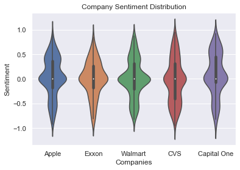
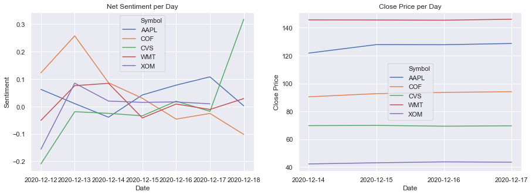

# [Sentiment-Driven Market Analysis with Twitter and Reddit](https://gilaniasher.github.io/sentiment-driven-market-analysis/)
By: Asher Gilani, Hasan Muhammad, Arjun Rajkumar

## Objectives
The rise of social media has given access to a huge volume of discussion on almost any topic imaginable. One such topic is company-related news with social media discussion acting as a proxy for public sentiment towards a given brand. We want to use discussion on social media to to try and predict performance of big companies in the stock market. We will try to use the sentiments shared towards companies on Twitter as an initial benchmark to compare against stock market movement. Then, we will look at investing communities on Reddit to see how discussions on another platform compare. If a correlation is found, we will have found a valuable source for companies to get instantaneous snapshots of how they are viewed by the public and how that image effects their monetary value. 

## Roadmap
- First explore/clean up the Kaggle Twitter Dataset
- Query the Yahoo Finance API for stocks to match the Twitter Dataset
- Use NLP and Vader sentiment analysis to generate a sentiment score for each tweet
- Use Twitter API to collect more recent stocks and do the same NLP processing
- Examine sentiment-stock correlations
- Build Linear Regression models to predict stock prices with sentiment scores
- Use Reddit API to examine stock sentiment

## Data Sources
- [Twitter Kaggle Dataset](https://www.kaggle.com/davidwallach/financial-tweets)
- [Yahoo Finance API](https://pypi.org/project/yfinance/)
- [Twitter API (Tweepy)](http://docs.tweepy.org/en/latest/)
- [Reddit API (PRAW)](https://praw.readthedocs.io/en/latest/)

# Some of the Work we Did

# Discussion
- We were not able to find direct insights into stock performance in a way that could make us money
    - The Twitter Kaggle dataset was too informative in nature so the NLP sentiment analysis was ineffective. It also only covered one month of data
    - The Twitter API seemed promising, but we were impeded by our ability to only query 7 days worth of Tweets which made it hard to see any correlations to stock prices even after normalization
    - The Reddit API seems to be the best choice going forwards. We are able to query as much data as we need and we are given much more data (Reddit score, number of comments, etc.)
    - Even so, we were not able to query more data for fear of exhausting our limited number of Reddit queries
- A lot of the Tweets and Reddit posts we have been pulling are somewhat random. In the future, it may be interesting to target specific demographics of people or industries to analyze sentiment there
    
## Notable Differences between Twitter and Reddit
- The sentiment distribution for Tweets is generally centered around 0 with an even amount of positive/negative tweets
- The r/investing subreddit had many higher sentiment distributions, generally being centered around 1
- This trend would need to be confirmed by investigating more companies and throughout a longer time range, but this was nonetheless interesting
- A plausible explanation is that people generally make posts on r/investing when there is good news, but people post on Twitter to post any and all interactions they have with large companies

## Next Steps
It would be interesting to repeat this entire process, but with larger Twitter and Reddit datasets. We were pretty limited by our APIs, but if we were to amass more data over time and save it locally, we could repeat our analysis. This may provide more insight into specific correlations or specific industries that are particularly sensitive to social media sentiment. It would also be interesting to see how well our Twitter Linear Regression models would perform in predicting stock prices on a rolling window. Similarly, it would be interesting to build Linear Regression models on the Reddit dataset since beyond just sentiment, we have information such as how popular the posts are and how many comments they have. We encourage our readers to continue this research as we believe we have provided a strong baseline for sentiment-driven market analysis.
